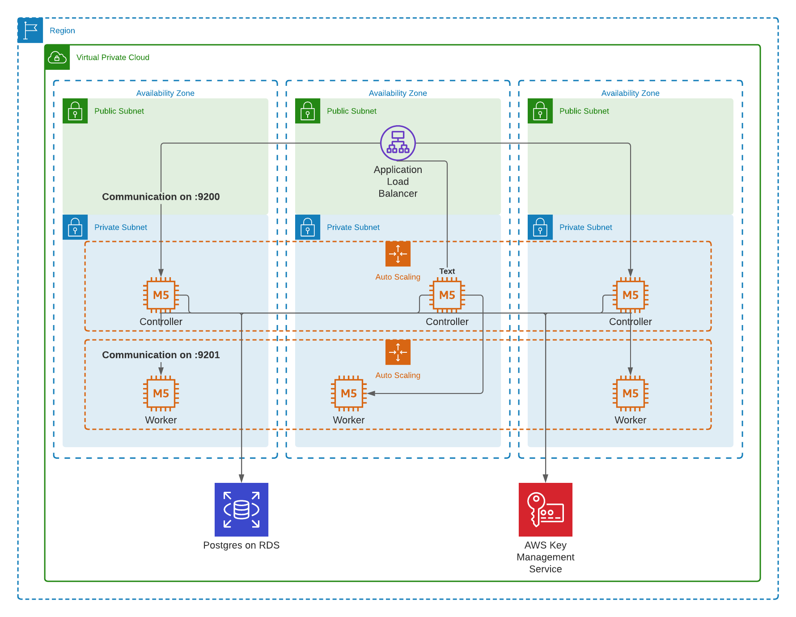
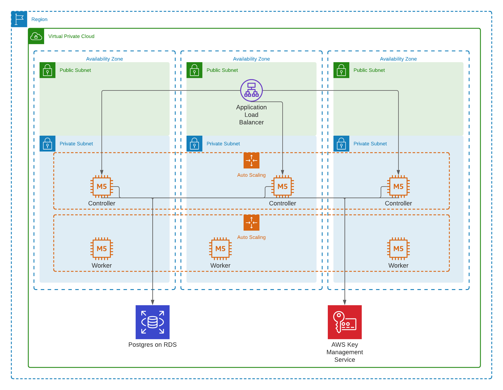

# Boundary AWS Reference Architecture
This repo contains Terraform AWS configuration for deploying Boundary.

## Reference

## Contents
- `deployment/`: Contains example Terraform configurations for deploying and configuring Boundary
