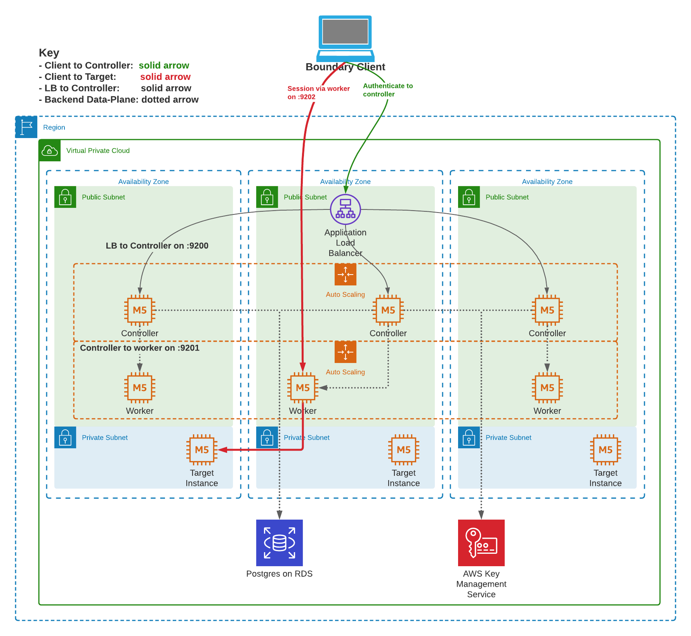

# Boundary AWS Reference Architecture
This repo contains Terraform AWS configuration for deploying Boundary.

Disclaimer: the examples in this repository are for demonstration purposes only to convey how to get Boundary up and running
on popular cloud and container platforms. They're not officially supported modules or designed to be "production" ready. They're
here as a starting point and assume end-users have experience with each example platform.

## Reference

## Contents
- `deployment/`: Contains example Terraform configurations for deploying and configuring Boundary on AWS for demonstration purposes.
