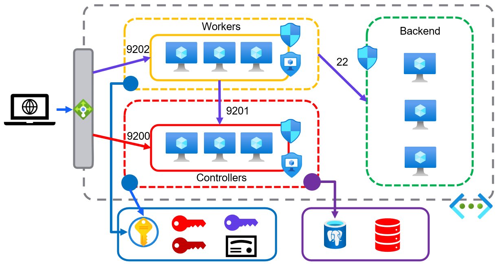

# Boundary Deployment Examples
This directory contains two deployment examples for Boundary using Terraform. The `azure/` directory contains an example Azure reference architecture codified in Terraform. The `boundary/` directory contains an example Terraform configuration for Boundary using the [Boundary Terraform Provider](https://github.com/hashicorp/terraform-provider-boundary).



## Requirements
- Terraform 0.13

## Deploy
To deploy this example:
- Ensure you are logged into Azure (`az login`)
- Run the following:

```
terraform init
terraform apply -target module.azure
```

This will spin up only the Azure infrastructure by targeting the Azure module. You can specify the version of Boundary you would like installed by using the variable `boundary_version`. By default it will use the latest version.

Once the infrastructure is finished provisioning, the output will be used to configure boundary. The configuration will create an SSH keypair and a self-signed certificate for TLS. The self-signed certificate is uploaded to the Key Vault. You will need to add the certificate to your trusted certificate authorities to move forward with the Boundary configuration. A future enhancement to the Boundary Terraform provider will allow you to skip TLS certificate validation.

The first controller VM and the first worker VM are accessible via a NAT rule on the load balancer. The controller is using port 2022, and the worker is using port 2023. You will use the SSH key pair created by the Terraform configuration (`azure_vms_private_key.pem`). You should need to remote into the controller and worker nodes, but you might want to for troubleshooting.

## Verify
- Once your AZure infra is live, you can SSH to your workers and controllers and see their configuration:
  - `ssh azureuser@<lb-public-ip> -p 2022`
  - `sudo systemctl status boundary-controller`
  - For workers, the systemd unit is called `boundary-worker` and the port is `2023`
  - The admin console will be available at `https://boundary-#######.<azure_region>.cloudapp.azure.com:9200`

## Configure Boundary 
- Add the self-signed certificate as a trusted cert on your system
- Configure boundary using `terraform apply` without the `target` flag and including the `boundary_version` variable if you used it.

Example:

```
terraform apply -var boundary_version=VERSION # If specific version required
```

The rest of the value for the Boundary config will come from the Azure module outputs.

## Login
- Open the console in a browser and login to the instance using one of the `backend_users` defined in the main.tf 
- Find your org, then project, then targets. Save the ID of the target. 
- Find your auth methods, and save the auth method ID.
- Login on the CLI: 

```
BOUNDARY_ADDR='https://boundary-#######.<azure_region>.cloudapp.azure.com:9200' \
  boundary authenticate password \
  -login-name=jim \
  -password foofoofoo \
  -auth-method-id=ampw_<some ID>
```

You can also use this login name in the Boundary console that you navigated to in the verify step.

## Connect

Connect to the target in the private subnet via Boundary:
- Copy the SSH private key `azure_vms_private_key.pem` to `~/.ssh/id_rsa` (Be sure to backup your existing `id_rsa` file first!)

```
BOUNDARY_ADDR='https://boundary-#######.<azure_region>.cloudapp.azure.com:9200:9200' \
  boundary connect ssh --username azureuser -target-id ttcp_<generated_id>
```

## Future improvements

- Allow the use of an existing SSH key
- Add BOUNDARY_TLS_IGNORE to the Boundary config once supported by the provider
- Update workers to use VMSS
- Tag workers in Boundary
